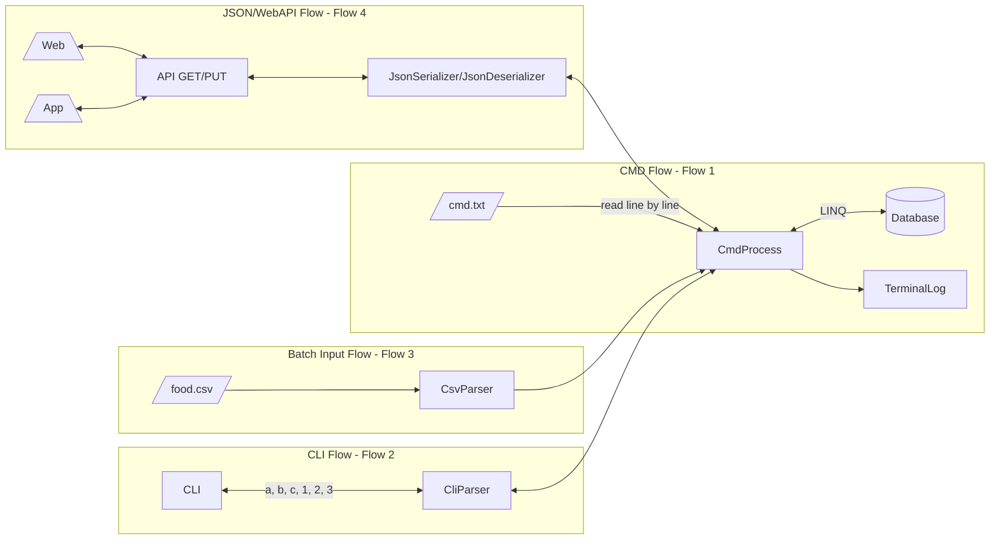

# Table of Contents

- Description
- Requirements
- Basic Design
  - CLI User Interface/User Interaction
    - Principles
    - CLI Flow Level 1
    - CLI Flow Level 2
    - All flowcharts
    - Notes
- Detailed Design

# Description

This is a sample food program to input foods and meals from CLI with provided classes from `201_samples` library.

# Requirements

- This should have an interface from command line to input foods and meals in 3 ways
  - Direct input by entering each field sequentially.
  - Batch input by using `|` separtor to input multiple fields.
    - Fields: `Food Name | Food Time | Food Steps | Food Views | IngredientNum`
    - Example: `Thịt gà rán | 15 | 5`
  - File input (`foods.csv` or `meals.csv`) by using a predefined format to input multiple rows.
  - Command file (`cmd.txt`) to CRUD and search foods, meals (**2022/Oct/27 Updates**)
- Libraries
  - .NET 6
  - .NET EF Core using SQLite
- API-oriented
- Code should be tested easily (**Design for Test**)

# Basic Design

## CLI User Interface/User Interaction

### Principles
- CRUD (create, read, update, delete)
- SOLID pattern

### CLI Flow Level 1

<details>
  <summary>Click here to expand</summary>

`S00` What do you want to do?
  1. List (or output) => `S10`
  2. Create (or add, input)  => `S20`
  3. Update => `S30`
  4. Delete => `S40`
  5. Search (find) => `S50`
  6. Quit (exit)

`S10` What do you want to list?
  1. Foods
  2. Meals
  3. All

`S20` What do you want to create?
  1. Foods
  2. Meals
  3. All (_optional_)

`S30` What do you want to update?
  1. Foods
  2. Meals
  3. All (_optional_)

`S40` What do you want to delete?
  1. Foods
  2. Meals
  3. All (**dangerous!!!**)

`S50` What do you want to find?
  1. Foods
  2. Meals
  3. All (_optional_)

If an invalid option is entered, the question will be appeared again!

</details>

### CLI Flow Level 2

<details>
  <summary>Click here to expand</summary>

```
S21 Create food

[CREATE] Please enter food name:
[CREATE] Please enter food steps:

[CREATE] Review:

Food name:
Food steps:

[CREATE] Save (Y/N)?

[CREATE] OK
or
[CREATE] NG

Go back to S00
```

```
S22 Create meal

[CREATE] Please enter meal name:
[CREATE] Please enter food ID list:

[CREATE] Review:

Meal name:
Food list:
Food name list:

[CREATE] Save (Y/N)?

[CREATE] OK
or
[CREATE] NG

Go back to S00
```

```
S31 Update food

[UPDATE] Please enter food ID:

[UPDATE] Review:

Food name:
Food steps:

[UPDATE] Please enter new food name:
[UPDATE] Please enter new food steps:

[UPDATE] Review:

New food name:
New food steps:

[UPDATE] Save (Y/N)?

[UPDATE] OK
or
[UPDATE] NG

Go back to S00
```

```
S32 Update meal

[UPDATE] Please enter meal ID:

[UPDATE] Review:

Meal name:
Food list:
Food name list:

[UPDATE] Please enter new  meal name:
[UPDATE] Please enter new food ID list:

[UPDATE] Review:

New meal name:
New food list:
New food name list:

[UPDATE] Save (Y/N)?

[UPDATE] OK
or
[UPDATE] NG

Go back to S00
```

```
S41 Delete food

[DELETE] Please enter food ID:

[DELETE] Review:

Food name:
Food steps:

[UPDATE] Save (Y/N)?

[UPDATE] OK
or
[UPDATE] NG

Go back to S00
```

```
S42 Delete meal

[DELETE] Please enter meal ID:

[DELETE] Save (Y/N)?

[DELETE] OK
or
[DELETE] NG

Go back to S00
```

```
S43 Delete all

[DELETE] Please be very careful!!!

[DELETE] Save (Y/N)?

[DELETE] OK
or
[DELETE] NG

Go back to S00
```

```
S50 Search food

[SEARCH] Please enter food ID:

Food name:
Food steps:
```

```
S51 Search meal

[SEARCH] Please enter meal ID:

[SEARCH] Review:

Meal name:
Food list:
Food name list:
```

</details>

### All flowcharts



### Classes

1. CMD Class
2. CLI Class
3. CSV Class
4. JsonFood Class

### Notes
- FDP is synonym for Food Demo Program.
- S is synonym for State.
- If there are **30,000** foods at `S10`, should it be listed all?
- How to parition FDP to reuse or extend functionality later?
- `csv` input file is only used to input large number of foods. How to control FDP from command line such as delete foods?
  - Use more general file such as command file `cmd.txt` to interact with FDP

  <details>
    <summary>Click here to expand</summary>

  - `cmd.txt` format is `CMD | REG | VAL`
    - Commands `CMD` are
      - `LIST`
      - `CREATE`
      - `UPDATE`
      - `DELETE`
      - `SEARCH`
    - Register `REG` are
      - `Foods`
      - `Meals`
      - `All`
    - Value `VAL` are
      - For `Foods` register
        - `Food Name | Food Time | Food Steps | Food Views | IngredientNum`
      - For `Meals` register
        - `Meal Name | FoodId Item 1, FoodId Item 2`
    - Example
      ```
      LIST   | Foods
      CREATE | Foods | Trung ran   | 10
      CREATE | Foods | Rau cai xao | 15
      CREATE | Foods | Thit luoc   | 20
      CREATE | Foods | Nuoc mam    | 4
      CREATE | Foods | Rau muong luoc | 20
      CREATE | Foods | Dau phu luoc   | 5
      CREATE | Foods | Nem ran        | 60
      LIST
      UPDATE | Foods | ID | 3 | 4
      LIST
      DELETE | Foods | ID | 5
      LIST
      ```
  - Reg is synomnym for register that is used when test ALU in CPU!!! _Please recommend better word if you can!_.
  </details>

- How to test code efficiently? For example: when code is updated and regression is ran, PASSED or FAILED testcases should be reported.

### References

- [[Google Books] Systems Analysis and Design: An Object-Oriented Approach with UML](https://books.google.com/books?id=rbLrBgAAQBAJ)
- [[Wikipedia] Systems development life cycle](https://en.wikipedia.org/wiki/Systems_development_life_cycle)
- [[Wikipedia] SOLID](https://en.wikipedia.org/wiki/SOLID)

# Detailed Design


